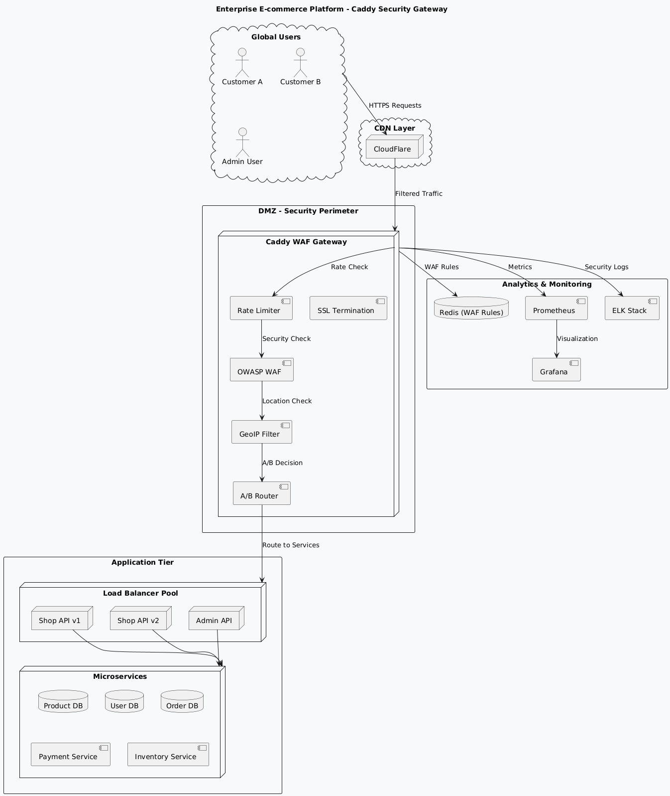
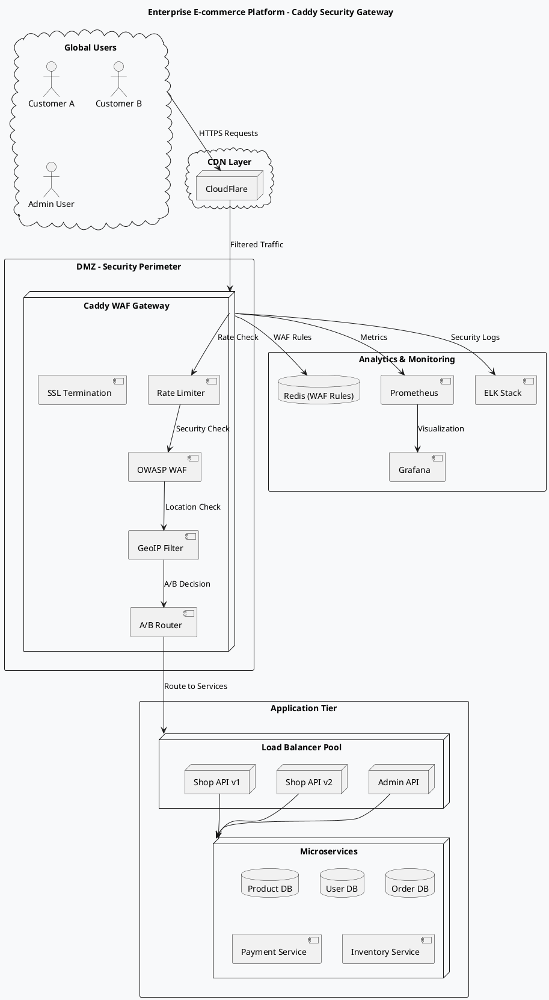
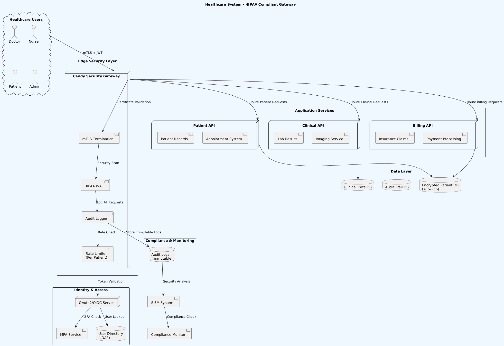
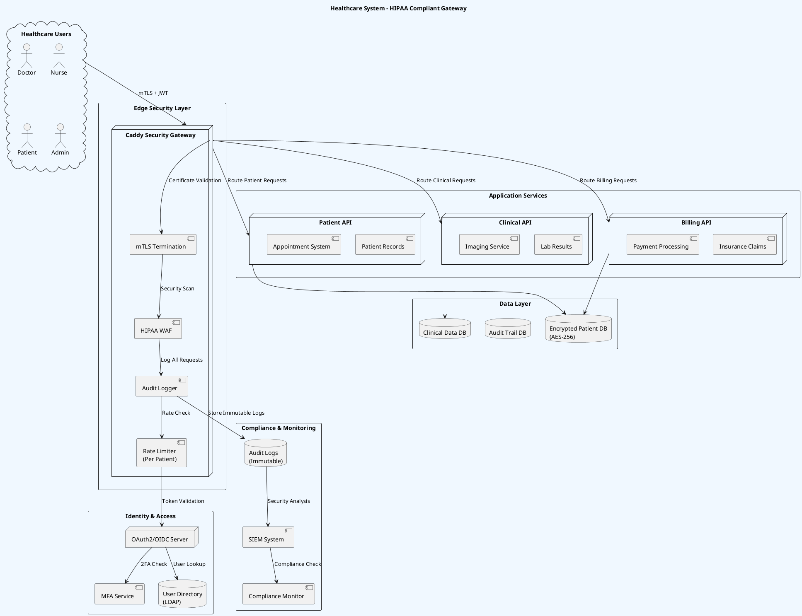
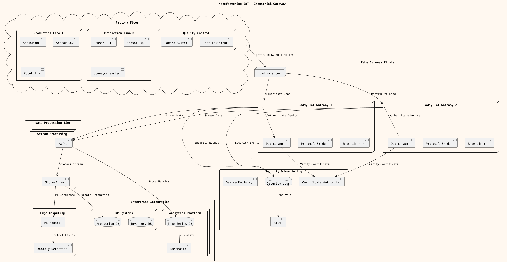
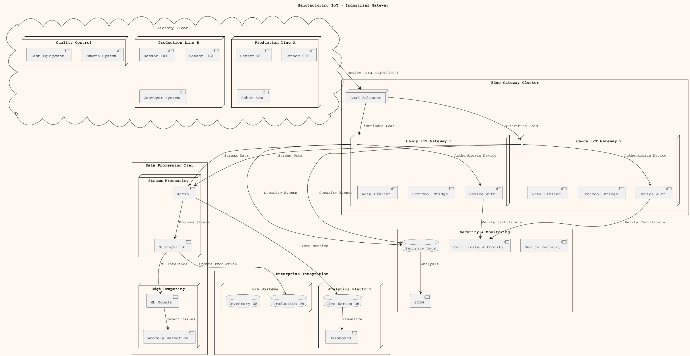
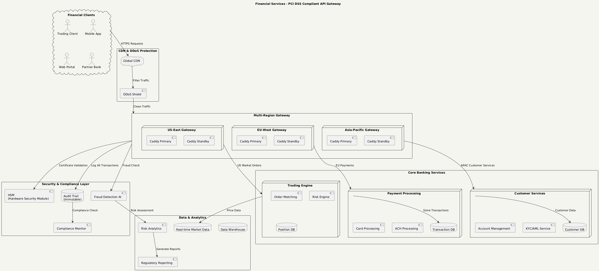
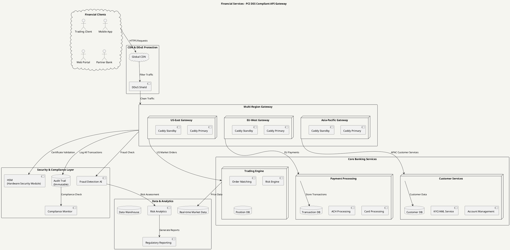
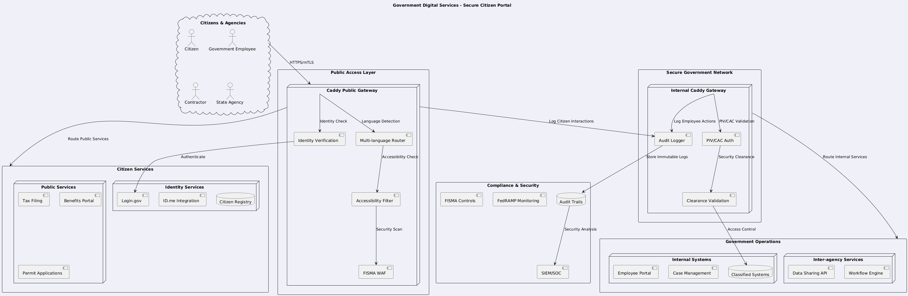
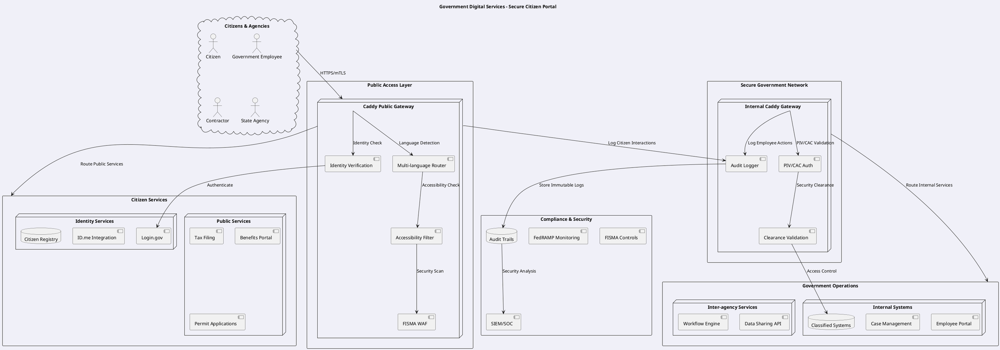

# Enterprise Caddy Use Cases และ System Diagrams

## 🏢 Use Case 1: E-commerce Platform Security Gateway

### Business Requirements
- Multi-tenant e-commerce platform
- PCI DSS compliance
- Global CDN integration
- Advanced threat protection
- A/B testing capabilities

### System Architecture



### Caddy Configuration
```caddyfile
{
  email security@company.com
  order coraza_waf first
  order rate_limit before reverse_proxy
  
  log {
    output file /var/log/caddy/security.log {
      roll_size 100MB
      max_age 30
    }
    format json
  }
}

# Admin Dashboard - Strict Security
admin.company.com {
  @admin_allowlist {
    remote_ip 192.168.1.0/24 10.0.0.0/8
  }
  respond @admin_allowlist "Admin access restricted" 403
  
  rate_limit {
    zone admin {
      key {remote_host}
      events 20
      window 1m
    }
  }
  
  coraza_waf {
    directives `
      SecRuleEngine On
      Include @owasp_crs/*.conf
      SecRule REQUEST_URI "@contains /admin/finance" "id:1001,deny,status:403"
    `
  }
  
  basicauth {
    admin $2a$14$hashed_password
  }
  
  reverse_proxy admin-api:8080
}

# Public API - A/B Testing + WAF
api.company.com {
  rate_limit {
    zone api_burst {
      key {remote_host}
      events 1000
      window 1m
    }
    zone api_sustained {
      key {remote_host}  
      events 10000
      window 1h
    }
  }
  
  coraza_waf {
    load_owasp_crs
    directives `
      SecRuleEngine On
      Include @owasp_crs/*.conf
      
      # PCI DSS Rules
      SecRule ARGS "@detectSQLi" "id:2001,deny,status:403,msg:'SQL Injection'"
      SecRule REQUEST_BODY "@contains 4[0-9]{12}(?:[0-9]{3})?" "id:2002,deny,status:403,msg:'Credit Card Number Detected'"
    `
  }
  
  # A/B Testing
  @version_a {
    header_regexp User-Agent ".*Mobile.*"
  }
  @version_b {
    not header_regexp User-Agent ".*Mobile.*"
  }
  
  handle @version_a {
    reverse_proxy api-v2:8080 {
      header_up X-Version "v2-mobile"
    }
  }
  
  handle @version_b {
    reverse_proxy api-v1:8080 {
      header_up X-Version "v1-desktop"  
    }
  }
}

# Main Website - CDN Integration
www.company.com {
  header {
    Strict-Transport-Security "max-age=31536000; includeSubDomains; preload"
    Content-Security-Policy "default-src 'self'; script-src 'self' 'unsafe-inline' cdn.company.com"
  }
  
  rate_limit {
    zone website {
      key {remote_host}
      events 200
      window 1m
    }
  }
  
  # Cache static assets
  @static {
    path *.css *.js *.png *.jpg *.gif *.ico
  }
  header @static Cache-Control "public, max-age=31536000"
  
  reverse_proxy frontend:3000
}
```

---

## 🏥 Use Case 2: Healthcare System Gateway

### Business Requirements
- HIPAA compliance
- Zero-trust architecture
- API rate limiting per patient
- Audit logging
- Multi-factor authentication

### System Architecture



### Caddy Configuration
```caddyfile
{
  email compliance@hospital.com
  order coraza_waf first
  order rate_limit before reverse_proxy
  
  # HIPAA Compliant Logging
  log {
    output file /var/log/caddy/hipaa_audit.log {
      roll_size 50MB
      max_age 2555  # 7 years retention
      compress
    }
    format json {
      fields {
        timestamp
        request>remote_ip
        request>method
        request>uri
        request>headers>authorization
        request>headers>x-patient-id
        response>status
        security>blocked
        security>rule_id
        hipaa>phi_accessed
      }
    }
  }
}

# Patient Portal - Strict HIPAA Controls
portal.hospital.com {
  # mTLS for device authentication
  tls {
    client_auth {
      mode require_and_verify
      trusted_ca_cert_file /etc/caddy/ca-bundle.pem
    }
  }
  
  # HIPAA-specific WAF rules
  coraza_waf {
    directives `
      SecRuleEngine On
      Include @owasp_crs/*.conf
      
      # HIPAA PHI Protection Rules
      SecRule RESPONSE_BODY "@contains ssn\|social.*security" \
        "id:3001,phase:4,deny,status:500,msg:'PHI Leak Prevented'"
      
      SecRule REQUEST_URI "@contains /patient/[0-9]+/records" \
        "!@verifyCC @beginsWith %{REQUEST_HEADERS.x-patient-id}" \
        "id:3002,phase:1,deny,status:403,msg:'Unauthorized patient access'"
      
      # Audit all PHI access
      SecRule REQUEST_URI "@contains /patient\|/medical\|/records" \
        "id:3003,phase:1,pass,log,msg:'PHI Access Logged'"
    `
  }
  
  # Patient-specific rate limiting
  rate_limit {
    zone patient_access {
      key {http.request.header.x-patient-id}
      events 100
      window 1h
    }
    
    zone ip_limit {
      key {remote_host}
      events 50
      window 5m
    }
  }
  
  # JWT validation middleware
  jwt {
    primary_key_file /etc/caddy/jwt-public.pem
    algorithm RS256
    audience "hospital-portal"
    issuer "https://auth.hospital.com"
  }
  
  reverse_proxy patient-api:8080 {
    header_up X-Audit-User {http.request.header.x-user-id}
    header_up X-Request-ID {uuid}
  }
}

# Clinical API - Role-based Access
api.hospital.com {
  # Role-based routing
  @doctor_access {
    path /api/clinical/* /api/patients/*/full-record
    header_regexp Authorization ".*role=doctor.*"
  }
  
  @nurse_access {
    path /api/patients/*/basic-info /api/medications/*
    header_regexp Authorization ".*role=nurse.*"  
  }
  
  @admin_access {
    path /api/admin/* /api/billing/*
    header_regexp Authorization ".*role=admin.*"
  }
  
  # Strict rate limiting for sensitive operations
  rate_limit {
    zone clinical_writes {
      match {
        method POST PUT DELETE
        path /api/clinical/*
      }
      key {http.request.header.x-user-id}
      events 10
      window 1m
    }
  }
  
  handle @doctor_access {
    reverse_proxy clinical-api:8080
  }
  
  handle @nurse_access {
    reverse_proxy patient-api:8080
  }
  
  handle @admin_access {
    reverse_proxy admin-api:8080
  }
  
  respond "Unauthorized" 403
}
```

---

## 🏭 Use Case 3: Manufacturing IoT Gateway

### Business Requirements
- Industrial IoT device management
- Edge computing integration
- Real-time data streaming
- Security for OT networks
- Scalable device authentication

### System Architecture



### Caddy Configuration
```caddyfile
{
  email iot@manufacturing.com
  order device_auth first
  order rate_limit before reverse_proxy
  
  # High-volume IoT logging
  log {
    output file /var/log/caddy/iot_gateway.log {
      roll_size 500MB
      max_age 90
    }
    format json {
      fields {
        timestamp
        device_id
        sensor_type
        data_size
        processing_time
        security_status
      }
    }
  }
}

# IoT Device Data Ingestion
iot.manufacturing.com {
  # Device certificate authentication
  tls {
    client_auth {
      mode require_and_verify
      trusted_ca_cert_file /etc/caddy/device-ca.pem
    }
  }
  
  # Device-specific rate limiting
  rate_limit {
    zone device_telemetry {
      key {tls_client_serial}
      events 3600    # 1 per second
      window 1h
    }
    
    zone device_commands {
      key {tls_client_serial}
      events 60      # 1 per minute for commands
      window 1m
    }
  }
  
  # Protocol-specific routing
  @mqtt_devices {
    path /mqtt/*
    header Content-Type "application/mqtt"
  }
  
  @http_sensors {
    path /sensors/*
    method POST
  }
  
  @device_commands {
    path /commands/*
    method POST PUT
  }
  
  # MQTT bridge
  handle @mqtt_devices {
    reverse_proxy mqtt-broker:1883 {
      transport fastcgi {
        root /mqtt
      }
      header_up X-Device-ID {tls_client_serial}
      header_up X-Timestamp {time.now.unix}
    }
  }
  
  # Sensor data processing
  handle @http_sensors {
    # Validate sensor data format
    @valid_sensor_data {
      header Content-Type "application/json"
      path_regexp sensor_path /sensors/([a-zA-Z0-9]+)/data
    }
    
    handle @valid_sensor_data {
      reverse_proxy sensor-processor:8080 {
        header_up X-Sensor-ID {re.sensor_path.1}
        header_up X-Device-Cert {tls_client_serial}
        
        # Load balancing for high throughput
        lb_policy least_conn
        health_uri /health
        health_interval 10s
      }
    }
    
    respond "Invalid sensor data format" 400
  }
  
  # Device command handling
  handle @device_commands {
    # Security check for commands
    @authorized_commands {
      header_regexp Authorization "Bearer .*admin.*"
    }
    
    handle @authorized_commands {
      rate_limit {
        zone critical_commands {
          key {http.request.header.authorization}
          events 10
          window 1m
        }
      }
      
      reverse_proxy command-processor:8080 {
        header_up X-Command-Source "gateway"
        header_up X-Security-Level "verified"
      }
    }
    
    respond "Unauthorized command" 403
  }
}

# Manufacturing Dashboard API
dashboard-api.manufacturing.com {
  # Employee authentication
  basicauth {
    operator $2a$14$operator_hash
    supervisor $2a$14$supervisor_hash
    manager $2a$14$manager_hash
  }
  
  # Role-based access control
  @operator_access {
    path /api/sensors/* /api/status/*
    header_regexp Authorization ".*operator.*"
  }
  
  @supervisor_access {
    path /api/production/* /api/quality/*
    header_regexp Authorization ".*supervisor.*"
  }
  
  @manager_access {
    path /api/reports/* /api/analytics/*
    header_regexp Authorization ".*manager.*"
  }
  
  handle @operator_access {
    reverse_proxy dashboard-api:8080
  }
  
  handle @supervisor_access {
    reverse_proxy production-api:8080
  }
  
  handle @manager_access {
    reverse_proxy analytics-api:8080
  }
  
  respond "Access Denied" 403
}

# Real-time Data Streaming
stream.manufacturing.com {
  # WebSocket support for real-time data
  @websocket {
    header Connection upgrade
    header Upgrade websocket
  }
  
  handle @websocket {
    reverse_proxy stream-server:8080 {
      header_up X-Real-IP {remote_host}
      header_up X-Forwarded-Proto {scheme}
    }
  }
  
  # Server-Sent Events for dashboard updates
  @sse {
    path /events/*
    header Accept "text/event-stream"
  }
  
  handle @sse {
    reverse_proxy event-server:8080 {
      header_down Content-Type "text/event-stream"
      header_down Cache-Control "no-cache"
      header_down Connection "keep-alive"
    }
  }
  
  reverse_proxy dashboard:3000
}
```

---

## 🏦 Use Case 4: Financial Services API Gateway

### Business Requirements
- PCI DSS Level 1 compliance
- Ultra-low latency trading
- Multi-region deployment
- Advanced fraud detection
- Regulatory audit trails

### System Architecture



### Caddy Configuration
```caddyfile
{
  email compliance@bank.com
  order fraud_detection first
  order pci_waf before reverse_proxy
  
  # PCI DSS Compliant Logging
  log {
    output file /var/log/caddy/pci_audit.log {
      roll_size 100MB
      max_age 2555  # 7 years for PCI compliance
      compress
      encrypt aes256 /etc/caddy/log_encryption.key
    }
    format json {
      fields {
        timestamp
        request>remote_ip
        request>method
        request>uri
        request>headers>x-api-key
        request>headers>x-customer-id
        response>status
        response>latency_ms
        security>fraud_score
        security>pci_validated
        compliance>audit_id
      }
    }
  }
}

# Trading API - Ultra Low Latency
trading-api.bank.com {
  # Hardware security module integration
  tls {
    cert /etc/caddy/hsm/trading-cert.pem
    key /etc/caddy/hsm/trading-key.pem
    protocols tls1.3  # Only TLS 1.3 for performance
  }
  
  # Strict rate limiting for trading
  rate_limit {
    zone trading_burst {
      key {http.request.header.x-trader-id}
      events 10000      # High frequency trading
      window 1s
    }
    
    zone trading_daily {
      key {http.request.header.x-trader-id}
      events 1000000    # Daily limit
      window 24h
    }
  }
  
  # PCI DSS WAF rules
  coraza_waf {
    directives `
      SecRuleEngine On
      
      # PCI DSS Required Rules
      SecRule REQUEST_BODY "@contains 4[0-9]{12}(?:[0-9]{3})?" \
        "id:4001,phase:2,deny,status:403,msg:'Credit Card Number in Request'"
      
      SecRule RESPONSE_BODY "@contains 4[0-9]{12}(?:[0-9]{3})?" \
        "id:4002,phase:4,deny,status:500,msg:'Credit Card Leak Prevented'"
      
      # Trading-specific validation
      SecRule REQUEST_URI "@contains /orders" \
        "REQUEST_METHOD !@pm POST GET DELETE" \
        "id:4003,phase:1,deny,status:405,msg:'Invalid trading method'"
      
      SecRule ARGS:order_amount "@gt 1000000" \
        "id:4004,phase:2,deny,status:403,msg:'Order amount exceeds limit'"
    `
  }
  
  # Fraud detection integration
  fraud_detection {
    ml_model_path /etc/caddy/models/fraud_model.pkl
    risk_threshold 0.85
    block_high_risk true
    
    features {
      ip_reputation true
      transaction_velocity true
      device_fingerprint true
      behavioral_analysis true
    }
  }
  
  # Ultra-fast routing for trading
  reverse_proxy trading-engine:8080 {
    transport http {
      compression off        # Disable compression for speed
      keepalive 30s
      keepalive_idle_conns 1000
      max_conns_per_host 500
    }
    
    header_up X-Trader-ID {http.request.header.x-trader-id}
    header_up X-Request-Time {time.now.unix_nano}
    header_up X-Gateway-Region "us-east-1"
    
    # Load balancing for high availability
    to trading-engine-1:8080
    to trading-engine-2:8080
    to trading-engine-3:8080
    
    lb_policy least_latency
    health_uri /health
    health_interval 1s
    health_timeout 100ms
  }
}

# Payment API - PCI DSS Level 1
payments-api.bank.com {
  # Tokenization for card data
  @card_transactions {
    path /api/payments/cards/*
    method POST
  }
  
  handle @card_transactions {
    # Pre-process: Tokenize sensitive data
    rewrite * /api/payments/tokens{uri}
    
    # Enhanced security for card payments
    rate_limit {
      zone card_payments {
        key {http.request.header.x-customer-id}
        events 10
        window 1m
      }
    }
    
    # Strict PCI validation
    coraza_waf {
      directives `
        SecRuleEngine On
        
        # Validate card data format
        SecRule REQUEST_BODY "@contains card_number" \
          "!@rx \"card_number\":\"tok_[a-zA-Z0-9]{16}\"" \
          "id:5001,phase:2,deny,status:400,msg:'Invalid token format'"
        
        # Ensure encryption
        SecRule REQUEST_HEADERS:Content-Type "!@contains application/jose" \
          "id:5002,phase:1,deny,status:400,msg:'Unencrypted payment data'"
      `
    }
    
    reverse_proxy payment-processor:8080 {
      header_up X-PCI-Validated "true"
      header_up X-Encryption-Level "aes256"
    }
  }
  
  # ACH/Wire transfers
  @ach_transfers {
    path /api/payments/ach/*
    method POST
  }
  
  handle @ach_transfers {
    # Regulatory compliance checks
    @large_transfers {
      header_regexp X-Transfer-Amount "[1-9][0-9]{4,}"  # > $10K
    }
    
    handle @large_transfers {
      # Additional verification for large transfers
      basicauth {
        supervisor $2a$14$supervisor_hash
      }
      
      # Mandatory compliance logging
      log {
        output file /var/log/caddy/large_transfers.log
        format json {
          fields {
            timestamp
            customer_id
            transfer_amount
            destination_bank
            approval_code
          }
        }
      }
    }
    
    reverse_proxy ach-processor:8080
  }
}

# Customer Portal - Multi-factor Authentication
portal.bank.com {
  # Device fingerprinting
  @new_device {
    not header X-Device-ID
  }
  
  handle @new_device {
    # Redirect to device registration
    redir /device-setup 302
  }
  
  # Customer authentication
  jwt {
    primary_key_file /etc/caddy/jwt-public.pem
    algorithm RS256
    audience "bank-portal"
    
    # Additional MFA validation
    claim_validation {
      mfa_verified true
      device_trusted true
    }
  }
  
  # Session-based rate limiting
  rate_limit {
    zone customer_session {
      key {http.request.header.x-session-id}
      events 1000
      window 1h
    }
  }
  
  # Customer data protection
  @sensitive_data {
    path /api/accounts/* /api/statements/* /api/profile/*
  }
  
  handle @sensitive_data {
    # Additional encryption for sensitive responses
    header {
      Content-Security-Policy "default-src 'self'; connect-src 'self' https://api.bank.com"
      X-Content-Type-Options "nosniff"
      Strict-Transport-Security "max-age=31536000; includeSubDomains; preload"
    }
    
    reverse_proxy customer-api:8080 {
      header_up X-Customer-Verified "true"
      header_up X-Audit-Required "true"
    }
  }
  
  reverse_proxy portal-frontend:3000
}

# Partner Bank Integration - B2B Gateway
partners-api.bank.com {
  # Mutual TLS for partner authentication
  tls {
    client_auth {
      mode require_and_verify
      trusted_ca_cert_file /etc/caddy/partner-ca-bundle.pem
    }
  }
  
  # Partner-specific rate limiting
  rate_limit {
    zone partner_api {
      key {tls_client_serial}
      events 10000
      window 1h
    }
  }
  
  # Partner routing based on certificate
  @partner_jpmorgan {
    tls_client_subject "CN=JPMorgan Chase"
  }
  
  @partner_wells_fargo {
    tls_client_subject "CN=Wells Fargo"
  }
  
  handle @partner_jpmorgan {
    reverse_proxy jpmorgan-adapter:8080 {
      header_up X-Partner-ID "jpmorgan"
      header_up X-SLA-Tier "premium"
    }
  }
  
  handle @partner_wells_fargo {
    reverse_proxy wells-fargo-adapter:8080 {
      header_up X-Partner-ID "wells-fargo"
      header_up X-SLA-Tier "standard"
    }
  }
  
  respond "Unknown Partner" 403
}
```

---

## 🏢 Use Case 5: Government Digital Services Gateway

### Business Requirements
- Citizen identity verification
- FISMA/FedRAMP compliance
- Multi-language support
- Accessibility (Section 508)
- High availability for critical services

### System Architecture



### Caddy Configuration
```caddyfile
{
  email security@government.gov
  order identity_verification first
  order fisma_waf before reverse_proxy
  
  # FISMA-compliant logging
  log {
    output file /var/log/caddy/gov_services.log {
      roll_size 50MB
      max_age 2555  # 7 years retention
      compress
      encrypt aes256 /etc/caddy/fisma_key
    }
    format json {
      fields {
        timestamp
        citizen_id_hash
        service_accessed
        clearance_level
        audit_trail_id
        compliance_status
        accessibility_mode
      }
    }
  }
}

# Public Citizen Portal
services.gov {
  # Multi-language support
  @english {
    header Accept-Language "*en*"
  }
  @spanish {
    header Accept-Language "*es*"
  }
  @chinese {
    header Accept-Language "*zh*"
  }
  
  # Accessibility compliance (Section 508)
  @screen_reader {
    header User-Agent "*NVDA*|*JAWS*|*VoiceOver*"
  }
  
  handle @screen_reader {
    header {
      X-Accessibility-Mode "high-contrast"
      X-Screen-Reader-Compatible "true"
    }
    rewrite * /accessible{uri}
  }
  
  # FISMA-compliant WAF
  fisma_waf {
    security_level "moderate"  # FISMA Moderate baseline
    
    rules {
      # Government-specific protections
      block_countries ["CN", "RU", "IR", "KP"]  # OFAC restricted
      require_https true
      validate_csrf true
      
      # Protect against government-targeted attacks
      detect_apt_patterns true
      block_tor_exit_nodes true
      require_valid_tls_cert true
    }
  }
  
  # Identity verification integration
  identity_verification {
    provider "login.gov"
    backup_provider "id.me"
    
    # IAL (Identity Assurance Level) requirements
    @high_assurance_services {
      path /benefits/* /tax-filing/* /security-clearance/*
    }
    
    handle @high_assurance_services {
      require_ial "2"  # Government verified identity
      require_aal "2"  # Multi-factor authentication
    }
    
    # Standard services
    require_ial "1"
    require_aal "1"
  }
  
  # Language-specific routing
  handle @english {
    reverse_proxy citizen-portal-en:8080 {
      header_up Accept-Language "en-US"
    }
  }
  
  handle @spanish {
    reverse_proxy citizen-portal-es:8080 {
      header_up Accept-Language "es-US"
    }
  }
  
  handle @chinese {
    reverse_proxy citizen-portal-zh:8080 {
      header_up Accept-Language "zh-CN"
    }
  }
  
  # Default to English
  reverse_proxy citizen-portal-en:8080
}

# Government Employee Portal
employee.gov {
  # PIV/CAC card authentication
  tls {
    client_auth {
      mode require_and_verify
      trusted_ca_cert_file /etc/caddy/gov-ca-bundle.pem
    }
  }
  
  # Security clearance validation
  clearance_validation {
    @secret_clearance {
      tls_client_cert_field "ou" "SECRET"
    }
    @top_secret_clearance {
      tls_client_cert_field "ou" "TOP SECRET"
    }
    @public_trust {
      tls_client_cert_field "ou" "PUBLIC TRUST"
    }
  }
  
  # Clearance-based access control
  @classified_systems {
    path /classified/* /intelligence/* /national-security/*
  }
  
  @sensitive_systems {
    path /personnel/* /investigations/* /law-enforcement/*
  }
  
  handle @classified_systems {
    # Require Top Secret clearance
    handle @top_secret_clearance {
      reverse_proxy classified-systems:8080 {
        header_up X-Clearance-Level "TOP SECRET"
        header_up X-Need-To-Know "verified"
      }
    }
    respond "Insufficient Clearance" 403
  }
  
  handle @sensitive_systems {
    # Require Secret or higher clearance
    handle @secret_clearance {
      reverse_proxy sensitive-systems:8080 {
        header_up X-Clearance-Level "SECRET"
      }
    }
    handle @top_secret_clearance {
      reverse_proxy sensitive-systems:8080 {
        header_up X-Clearance-Level "TOP SECRET"
      }
    }
    respond "Insufficient Clearance" 403
  }
  
  # Public Trust systems
  handle @public_trust {
    reverse_proxy public-systems:8080 {
      header_up X-Clearance-Level "PUBLIC TRUST"
    }
  }
  
  respond "No Valid Clearance" 403
}

# Inter-agency API Gateway
api.gov {
  # Agency-to-agency authentication
  @state_agencies {
    tls_client_cert_field "o" "*State of*"
  }
  @federal_agencies {
    tls_client_cert_field "o" "*Department of*|*Agency*"
  }
  @contractors {
    tls_client_cert_field "ou" "CONTRACTOR"
  }
  
  # Data sharing compliance
  data_sharing_compliance {
    log_all_requests true
    require_data_use_agreement true
    validate_purpose_limitation true
  }
  
  # Agency-specific rate limiting
  rate_limit {
    zone federal_api {
      key {tls_client_cert_field o}
      events 10000
      window 1h
    }
    
    zone state_api {
      key {tls_client_cert_field o}
      events 5000
      window 1h
    }
    
    zone contractor_api {
      key {tls_client_cert_field cn}
      events 1000
      window 1h
    }
  }
  
  # Route based on agency type
  handle @federal_agencies {
    reverse_proxy federal-data-api:8080 {
      header_up X-Agency-Type "federal"
      header_up X-Data-Classification "controlled"
    }
  }
  
  handle @state_agencies {
    reverse_proxy state-data-api:8080 {
      header_up X-Agency-Type "state"
      header_up X-Data-Classification "public"
    }
  }
  
  handle @contractors {
    # Limited contractor access
    @approved_contractors {
      tls_client_cert_field "cn" "Lockheed Martin|Raytheon|Booz Allen"
    }
    
    handle @approved_contractors {
      reverse_proxy contractor-api:8080 {
        header_up X-Agency-Type "contractor"
        header_up X-Data-Classification "limited"
      }
    }
    
    respond "Contractor Not Approved" 403
  }
  
  respond "Unknown Agency" 403
}
```

---

## 📊 Enterprise Caddy Implementation Summary

### Key Benefits Across All Use Cases

| Capability | E-commerce | Healthcare | Manufacturing | Financial | Government |
|------------|------------|------------|---------------|-----------|------------|
| **SSL/TLS Management** | ✅ Auto-renewal | ✅ HIPAA compliant | ✅ Device certificates | ✅ HSM integration | ✅ Government PKI |
| **WAF Protection** | ✅ OWASP CRS | ✅ PHI protection | ✅ OT security | ✅ PCI DSS rules | ✅ FISMA controls |
| **Rate Limiting** | ✅ Per-customer | ✅ Per-patient | ✅ Per-device | ✅ Per-trader | ✅ Per-agency |
| **Authentication** | ✅ OAuth/JWT | ✅ mTLS + MFA | ✅ Device certs | ✅ HSM tokens | ✅ PIV/CAC cards |
| **Compliance** | ✅ PCI DSS | ✅ HIPAA | ✅ IEC 62443 | ✅ SOX/PCI L1 | ✅ FISMA/FedRAMP |
| **Audit Logging** | ✅ Transaction logs | ✅ PHI access | ✅ OT operations | ✅ Trading records | ✅ Government access |
| **Performance** | ✅ CDN integration | ✅ Regional failover | ✅ Edge computing | ✅ Ultra-low latency | ✅ High availability |

### Common Implementation Patterns

#### 1. Security-First Architecture
```caddyfile
{
  # Always enforce security order
  order security_module first
  order rate_limit before reverse_proxy
  
  # Comprehensive logging
  log {
    format json
    output file /var/log/caddy/security.log
  }
}
```

#### 2. Multi-Tier Authentication
```caddyfile
# Layer 1: Network security (mTLS/certificates)
tls {
  client_auth {
    mode require_and_verify
  }
}

# Layer 2: Application security (JWT/OAuth)
jwt {
  primary_key_file /etc/caddy/jwt-key.pem
}

# Layer 3: Business logic security (role-based access)
@admin_users {
  header_regexp Authorization ".*role=admin.*"
}
```

#### 3. Compliance-Ready Configuration
```caddyfile
# Industry-specific WAF rules
compliance_waf {
  standard "PCI_DSS"  # or HIPAA, FISMA, etc.
  audit_level "strict"
  retention_years 7
}

# Immutable audit trails
audit_logger {
  output blockchain /var/log/caddy/audit_chain
  hash_algorithm sha256
  sign_with /etc/caddy/audit_private_key.pem
}
```

### 🎯 Deployment Recommendations

#### Small to Medium Enterprise (< 1000 users)
```bash
# Single Caddy instance with essential plugins
xcaddy build \
  --with github.com/mholt/caddy-ratelimit \
  --with github.com/corazawaf/coraza-caddy
```

#### Large Enterprise (1000+ users)
```bash
# High-availability cluster with advanced features
xcaddy build \
  --with github.com/corazawaf/coraza-caddy \
  --with github.com/mholt/caddy-ratelimit \
  --with github.com/Wafris/wafris-caddy \
  --with github.com/enterprise/caddy-hsm \
  --with github.com/enterprise/caddy-audit
```

#### Mission-Critical Systems
```bash
# Full enterprise suite with custom modules
xcaddy build \
  --with github.com/corazawaf/coraza-caddy \
  --with github.com/enterprise/caddy-compliance \
  --with github.com/enterprise/caddy-fraud-detection \
  --with github.com/enterprise/caddy-zero-trust \
  --with github.com/enterprise/caddy-blockchain-audit
```

### 🔧 Operational Excellence

#### Monitoring Integration
```caddyfile
# Prometheus metrics
metrics /metrics {
  disable_openmetrics
}

# Health checks
health_check /health {
  upstream_timeout 5s
  interval 30s
}

# Performance monitoring
performance_monitor {
  latency_threshold 100ms
  error_rate_threshold 1%
  alert_webhook https://alerts.company.com/webhook
}
```

#### High Availability Setup
```caddyfile
# Multi-region configuration
cluster {
  nodes ["caddy-us-east", "caddy-eu-west", "caddy-ap-south"]
  consensus_algorithm "raft"
  failover_timeout 30s
}

# Load balancing
upstream backend {
  least_conn
  health_uri /health
  fail_timeout 30s
  max_fails 3
}
```

This comprehensive enterprise implementation demonstrates how Caddy can serve as a robust, secure, and compliant gateway solution across various industry sectors, providing the foundation for modern digital infrastructure while maintaining simplicity and operational efficiency.